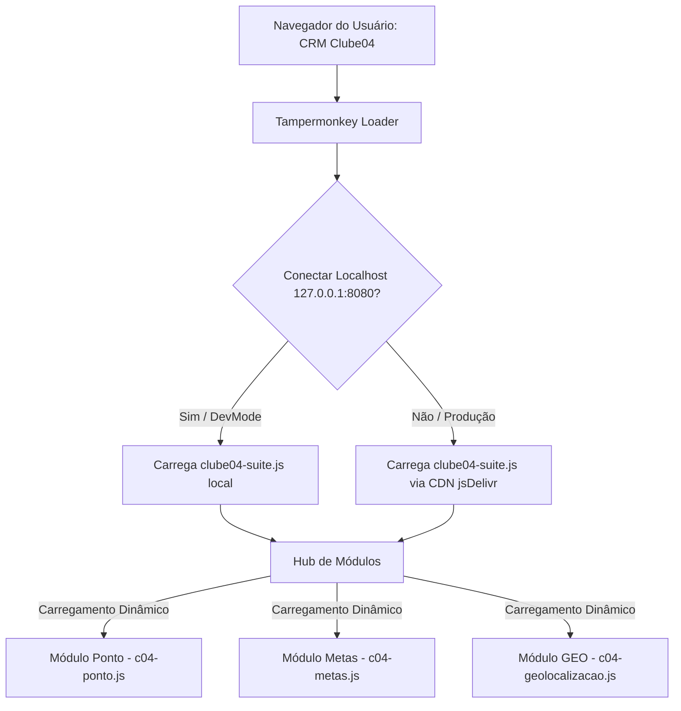

# Guia Técnico de Desenvolvimento (IA & Devs)

Este documento fornece as diretrizes arquiteturais, padrões de segurança e especificações de banco de dados da **Suite Central Clube04**. Ele serve como guia para desenvolvedores humanos e agentes de inteligência artificial (IA) que forem realizar manutenção ou expansão no ecossistema.

---

## 🏗️ Arquitetura Híbrida e Fluxo de Injeção

A Suite Central Clube04 opera de forma híbrida: ela roda diretamente dentro do navegador do usuário no contexto do CRM (Clube04 Digital) e se comunica com o backend do Supabase (PostgreSQL).



### Detalhes do Loader
*   O arquivo [tampermonkey-loader.user.js](tampermonkey-loader.user.js) é responsável por interceptar a página do CRM e injetar o script principal.
*   Ele realiza um handshake assíncrono (com timeout de 1200ms) para detectar se o desenvolvedor está com o servidor local ligado (`dev-mode.bat` rodando na porta `8080`).
*   Se o handshake falhar, ele faz o fallback seguro para o script de produção armazenado no GitHub e servido pela CDN jsDelivr (`https://cdn.jsdelivr.net/gh/cauenvieira/clube04@main/clube04-suite.js`).

---

## ⏱️ Ciclo de Vida e Limpeza Profunda (Teardown)

Para evitar vazamento de memória, listeners de eventos acumulados e poluição do DOM ao alternar entre os módulos ou fechar o painel, a suite implementa um protocolo estrito de limpeza:

1.  **Evento Global de Teardown**: Toda vez que um módulo é carregado ou desativado, o script principal dispara o evento global `c04_global_teardown` na janela (`window`).
2.  **Responsabilidade dos Módulos**: Cada módulo (`ponto`, `metas`, `geo`) deve escutar o evento `c04_global_teardown` e remover todos os listeners de eventos globais que adicionou no `window` ou no `document` (como listeners de teclado, cliques e mensagens).
3.  **Remoção Física de Elementos**: O script principal [clube04-suite.js](clube04-suite.js) localiza e remove fisicamente todos os contêineres e painéis inseridos no DOM (como `c04-painel`, `c04-ponto-painel` e `c04-geo-panel`) em vez de simplesmente ocultá-los (usando `display: none`).
4.  **Cursor e Estados**: O cursor do mouse do usuário deve ser resetado para `default` na body para evitar que loaders permaneçam travados.

---

## 🔒 Diretrizes de Segurança de Código e Manipulação do CRM

Ao interagir com a interface original do CRM, as seguintes restrições devem ser aplicadas de forma rígida:

### 1. Preservação do DOM Nativo
*   **Nunca** modifique, exclua ou remova elementos nativos da página original do CRM.
*   Toda a interface da suite deve ser construída dentro de elementos isolados adicionados ao final do `document.body` com prefixo `c04-`.
*   Para capturar dados de tabelas nativas, utilize consultas de DOM puras sem alterar o estado visual da tela original.

### 2. Coleta Assíncrona via Iframes Ocultos
*   Para buscar relatórios do CRM em segundo plano (como `relcliente.php`), a suite utiliza **iframes temporários ocultos** inseridos no DOM.
*   O iframe deve ser destruído e removido do DOM imediatamente após a conclusão da extração de dados.
*   **Nunca** mude a URL da página principal do usuário para realizar varreduras ou consultas secundárias.

### 3. Integridade do Cadastro
*   O módulo GEO é um visualizador e ferramenta de auditoria. Ele **não deve** realizar nenhuma gravação ou alteração de cadastro original no banco do CRM do Clube04.
*   As alterações feitas pelo usuário (como resolução de endereços incorretos) devem ser persistidas como *overrides* no banco GEO (Supabase) e aplicadas localmente em tempo de execução.

---

## 🗄️ Integração com Supabase (Postgres)

O backend do módulo GEO utiliza o Supabase via PostgREST. Toda comunicação de gravação/leitura deve seguir as seguintes regras para garantir o sucesso operacional:

### 1. Inserção em Lote (Bulk Insert) e Uniformidade de Chaves
> [!IMPORTANT]
> A API do Supabase (PostgREST) exige que todos os objetos dentro de um array enviado para inserção ou atualização em lote possuam **exatamente** o mesmo conjunto de chaves.
*   **Regra**: Se uma propriedade for opcional e estiver vazia, atribua explicitamente `null` à propriedade no objeto enviado.
*   **Exemplo**:
    ```javascript
    // Incorreto (causa erro "All object keys must match" no PostgREST)
    const lote = [
        { id_pessoa: 1, name: "Maria", phone: "11999999999" },
        { id_pessoa: 2, name: "João" } // Faltando a chave "phone"
    ];

    // Correto
    const lote = [
        { id_pessoa: 1, name: "Maria", phone: "11999999999" },
        { id_pessoa: 2, name: "João", phone: null }
    ];
    ```

### 2. Prevenção de Violações de Constraint `NOT NULL`
*   Garanta que campos obrigatórios recebam valores padrão coerentes (*fallbacks*) antes do envio ao banco.
*   Nomes nulos vindos do CRM devem ser convertidos para `"Cliente " + idPessoa`.
*   Se um endereço falhar na geocodificação, os campos de latitude e longitude no banco devem ser gravados como `0.0` com status `"failed"`, evitando falhas de `NOT NULL`.

### 3. Remoção Segura, Prevenção de Deadlocks e Bypasses do PostgREST
*   Para limpar o banco GEO de forma segura (`resetDatabase`), as tabelas com dependências e chaves estrangeiras devem ser limpas de forma sequencial e síncrona (usando `await` em promises separadas), respeitando a ordem de integridade referencial:
    1.  Tabelas filhas (`c04_daily_sales`, `c04_geocodes`).
    2.  Tabelas pai/principais (`c04_customers`, `c04_synced_days`, `c04_pendings`, `c04_logs`, `c04_backups`).
*   **Bypass de Broad Deletes**: O PostgREST do Supabase bloqueia requisições `DELETE` que não tenham parâmetros para evitar deleções acidentais em larga escala. Para contornar essa restrição em operações autorizadas de limpeza total ou parcial, a suite deve anexar um filtro de nulidade na chave primária (ex: `DELETE /rest/v1/c04_customers?id_pessoa=not.is.null`).
*   **Nunca** utilize deletes simultâneos desordenados no frontend, pois isso gera violações de restrições ou deadlocks (travamentos de transações) no PostgreSQL.

### 4. Ajuste de Timezone nos Logs e Backups
*   Os registros de execução (`c04_logs`) e snapshots (`c04_backups`) salvam a data/hora inicial de sincronização no formato ISO UTC (`new Date().toISOString()`).
*   No frontend, ao exibir esses logs e backups para o usuário no painel, deve-se formatar o timestamp no fuso horário local do navegador do usuário utilizando padrões brasileiros (`DD/MM/YYYY HH:mm:ss`).

---

## 🧪 Comandos e Testes de Verificação

Antes de realizar commits ou pushes no repositório, o desenvolvedor deve rodar a suíte completa de verificação para validar a sintaxe e a integridade de todos os módulos.

```bash
# Executa testes locais de unidade e sintaxe
npm run verify:all

# Executa os testes visuais de navegação E2E no CRM
node tests/navigation.test.js
```

Este comando executa:
1.  **Bateria de Testes Unitários**: Execução dos testes em `tests/*.test.js` (excluindo os testes de navegação que interagem com o CRM real) utilizando o executor de testes nativo do Node.js (`node --test`).
2.  **Validação de Sintaxe**: Checagem de sintaxe dos scripts JavaScript do Hub e dos módulos individuais via `node --check`.
3.  **Testes de Navegação Ponta a Ponta**: Validação completa da árvore de elementos, alternância de abas inline, e criação de backups em ambiente real via Puppeteer, gerando capturas de tela para auditoria visual na pasta `tests/screenshots/`.

Qualquer erro reportado por essas verificações impede a aprovação da integração de código e deve ser corrigido imediatamente.
