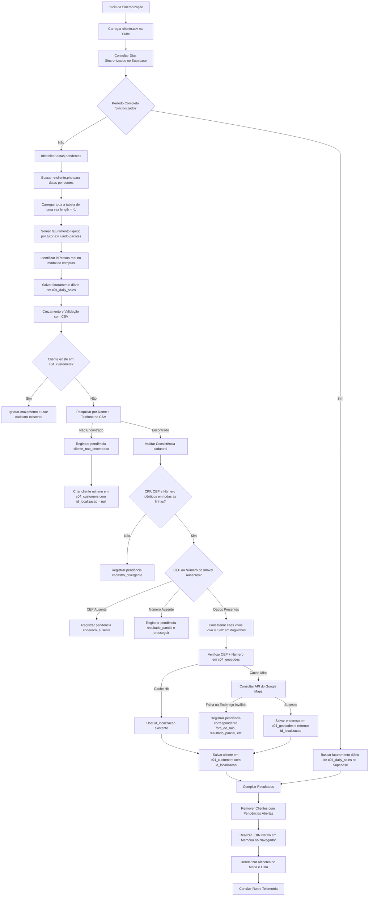

# Fluxo de Sincronização e Validação do Módulo GEO

Este documento descreve detalhadamente o fluxo de sincronização de dados do módulo GEO, cobrindo a extração de dados do CRM, o cruzamento com o arquivo de clientes (CSV), as validações cadastrais/geográficas executadas na camada de sincronização e o armazenamento no banco de dados do Supabase.

---

## 🗺️ Fluxograma de Sincronização (Mermaid)

---

## 📊 Matriz de Erros Cadastrais e Validações

Durante a sincronização, as seguintes validações cadastrais e geográficas são processadas de forma síncrona. Se alguma falhar, o cliente correspondente gera uma pendência com status `"open"` e é **removido** do resultado visual final para auditoria.

| Código do Erro (`Reason`) | Origem / Tipo | Regra Aplicada | Ação Recomendada |
| :--- | :--- | :--- | :--- |
| **`cliente_nao_encontrado`** | Validação de Cruzamento | O registro de venda/tutor no CRM não encontrou nenhuma correspondência de `Nome + Telefone` no arquivo `cliente.csv`. | Corrigir a divergência de nome ou telefone do cliente no CRM original. |
| **`cadastro_divergente`** | Validação de Cruzamento | O tutor possui múltiplas linhas no CSV que contêm `CPF`, `CEP` ou `Número` divergentes entre si. | Unificar as informações do cliente no CRM para que todas as fichas cadastrais fiquem idênticas. |
| **`endereco_ausente`** | Validação Cadastral | O campo de CEP (`zip`) está em branco ou zerado no CSV de clientes. | Adicionar o CEP correto no cadastro do cliente no CRM. |
| **`resultado_parcial`** | Validação Cadastral / Geográfica | O imóvel não possui número cadastrado ou a API do Google retornou uma localização não exata (apenas rua ou CEP geral). | Confirmar o número exato do imóvel no CRM e re-geocodificar. |
| **`fora_do_raio`** | Validação Geográfica | A localização calculada pelo Google Maps fica a uma distância maior que o limite configurado (padrão: 35km) em relação à unidade. | Verificar se a cidade ou estado do endereço estão corretos no cadastro do CRM. |
| **`estado_divergente`** | Validação Geográfica | A localização está fora do estado configurado para a unidade (padrão: SP). | Corrigir a UF/cidade no cadastro do cliente no CRM. |
| **`pais_divergente`** | Validação Geográfica | O endereço está fora do Brasil. | Corrigir o país no cadastro. |
| **`geocodificacao_falhou`** | Validação Geográfica | Erro de conexão com a API do Google Maps ou endereço não localizado. | Revisar a ortografia da rua, CEP e número no CRM. |

---

## 🛠️ Walkthrough Passo a Passo da Engenharia

### 1. Ingestão sem Paginação (CRM)
Para acelerar o scraping e garantir integridade, a suite altera o length do DataTable do CRM para `-1` (ou um valor superior a `9999`). Isso força o servidor a carregar todos os registros do dia corrente em uma página única. O loop de raspagem coleta os tutores e os valores líquidos de venda (filtros de pacotes) de uma só vez.

### 2. Resolução de Integridade Referencial Incremental
Para respeitar a restrição de chave estrangeira (`c04_daily_sales.id_cliente REFERENCES c04_customers(id_cliente)`), os novos clientes identificados e suas respectivas pendências cadastrais/geográficas são inseridos de forma incremental no banco de dados Supabase ao final de cada dia processado, **antes** de gravar o cache de faturamento em `c04_daily_sales`. Isso evita violações de FK quando o banco é zerado ou novas chaves primárias são criadas.

### 3. Filtro Inteligente de Animais Vivos (`doguinhos`)
Se um tutor possuir múltiplos animais cadastrados no CSV, eles virão como linhas repetidas. A suite agrupa essas linhas por `Nome + Telefone` e filtra a coluna `Vivo`. Apenas os animais cujo campo `Vivo` for exatamente `"Sim"` (ou `"sim"`) são concatenados por vírgula e armazenados no banco. Animais falecidos ou com outros status são ignorados.

### 4. Geocodificação Centralizada com Cache Composto
Para economizar consultas pagas na API do Google Maps, a suite implementa um cache no banco de dados Supabase na tabela `c04_geocodes`.
*   A busca no cache é feita utilizando a combinação única de `(cep, numero)`.
*   Se houver um **Cache Hit**, o sistema associa o cliente existente diretamente a esse endereço cadastrado (`id_localizacao`).
*   Se for um **Cache Miss**, a suite chama a API do Google Maps, valida a resposta geograficamente e, se válida, persiste o endereço em `c04_geocodes`, obtendo um novo `id_localizacao`.

### 5. JOIN em Memória e Filtragem de Pendências
Após a gravação, a suite realiza a busca e compilação dos dados do período selecionado:
1.  Busca as vendas diárias em `c04_daily_sales` filtradas pelo período.
2.  Busca todos os clientes em `c04_customers` e endereços em `c04_geocodes`.
3.  Busca as pendências abertas na tabela `c04_pendings` com status `"open"`.
4.  **Exclusão Rígida**: Qualquer cliente que possua um `idPessoa` na lista de pendências abertas é excluído do JOIN final.
5.  O join final entre faturamento diário, dados cadastrais (`nome`, `telefone`, `doguinhos`) e geocodificação (`rua`, `bairro`, `lat`, `lng`) ocorre inteiramente na memória do navegador do usuário, fornecendo performance instantânea de milissegundos para renderização do mapa e listagem.
