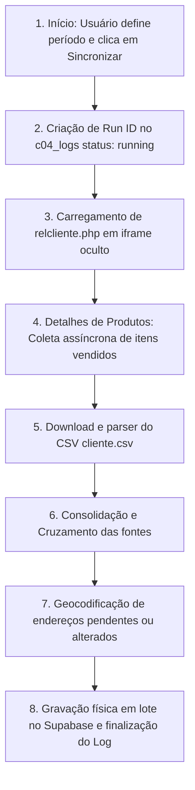

# Funcionamento Interno e Regras de Negócio • Módulo GEO

Este documento descreve detalhadamente a lógica de negócio, as regras de cruzamento de dados, as fórmulas matemáticas de pontuação (Score) e as decisões arquiteturais tomadas para o funcionamento do módulo GEO.

---

## 🔄 Fluxo Geral de Sincronização

A sincronização de um período é realizada através de um fluxo síncrono no frontend estruturado em 7 etapas principais:

A integridade do processo é garantida pela validação:
$$\text{Clientes Pertinentes} = \text{Clientes Aceitos} + \text{Clientes Rejeitados}$$
Caso essa equação não feche, a sincronização é abortada por inconsistência de dados.

---

## 🔀 Heurísticas de Cruzamento de Dados (Matching)

O CRM fornece dados de faturamento associados a um `idPessoa` (identificador único), enquanto o arquivo CSV de clientes (`cliente.csv`) fornece o cadastro de endereços, mas **não contém** o `idPessoa`. Para correlacionar as fontes, as seguintes regras hierárquicas são aplicadas:

1.  **Regra Primária: Tutor + Telefone Normalizado Exatos**:
    *   O sistema remove quebras de linha (` `) e informações de pets do nome do tutor em `relcliente.php`, obtendo o nome do tutor limpo.
    *   O telefone é extraído obtendo apenas os caracteres após o último separador `- ` e mantendo apenas dígitos numéricos.
    *   Se o nome do tutor e o telefone normalizado coincidirem exatamente com uma linha do CSV, o vínculo é estabelecido.
2.  **Fallback: Nome Único e Consistente**:
    *   Se a correspondência por telefone falhar (ou se o telefone estiver ausente em uma das fontes), o sistema pesquisa no próprio CSV de clientes pelo nome completo do tutor.
    *   Se for encontrado **exatamente um único cadastro** correspondente a esse nome no CSV de clientes, e ele for consistente, o vínculo é estabelecido.
    *   Caso haja duplicidade de nome com endereços distintos no CSV, o cruzamento falha por ambiguidade e uma pendência é gerada.
3.  **Criação de Cadastro Mínimo**:
    *   Se o tutor de `relcliente.php` não puder ser encontrado no CSV por nenhuma das regras anteriores, o sistema cria um cadastro mínimo contendo o `idPessoa`, nome e o telefone obtidos do relatório para fins de mapeamento provisório e alerta de pendência.

---

## 📊 Métricas e Definições Comerciais

As métricas de período são calculadas em memória durante a visualização:

*   **Visitas**: Quantidade de transações contidas na coluna `Num. Compras` do `relcliente.php`.
*   **Frequência**: O intervalo médio de dias entre compras informada na coluna `Freq. Compras` do relatório. Clientes sem este dado são desconsiderados de filtros de faixa de frequência.
*   **Valor Gasto Líquido (Serviços)**: Soma de todas as compras do período, **excluindo** itens cuja descrição contenha a palavra inteira normalizada `"pacote"`. Isso isola compras de pacotes recorrentes para evitar dupla contagem com a execução dos serviços.
*   **Ticket Médio de Serviços**: Valor Gasto Líquido dividido pelo número de Visitas.
*   **Última Compra**: A data da última transação registrada no período.

---

## 🧮 Fórmulas Matemáticas de Pontuação (Score)

O Score final de um cliente mede seu valor para o negócio no período selecionado. Por padrão, ele é calculado ponderando **60% para a Recorrência** e **40% para o Ticket Médio de Serviços**:

$$\text{Score} = (0.6 \times \text{Nota Recorrência}) + (0.4 \times \text{Nota Ticket})$$

### 1. Nota de Recorrência Contínua
A recorrência é calculada com base no intervalo de dias desde a última compra. A pontuação cai de forma linear e contínua de acordo com as seguintes faixas:

| Intervalo de Dias ($d$) | Pontuação ($P_{\text{rec}}$) | Classificação |
| --- | --- | --- |
| $d \le 7$ | $100 - (15 \times \frac{d}{7})$ | Excelente |
| $7 < d \le 15$ | $85 - (25 \times \frac{d - 7}{8})$ | Bom |
| $15 < d \le 30$ | $60 - (35 \times \frac{d - 15}{15})$ | Precisa Melhorar |
| $30 < d < 60$ | $25 - (25 \times \frac{d - 30}{30})$ | Ruim |
| $d \ge 60$ | $0$ | Ruim |

*Valores intermediários são calculados de forma contínua por interpolação linear, garantindo que um dia a menos de ausência sempre represente um score ligeiramente melhor.*

### 2. Nota de Ticket Médio
A nota de ticket é calculada dividindo o ticket médio de serviços do cliente por um **Ticket de Referência** configurável (ex: R$ 120,00) e limitando o resultado a 100%:

$$\text{Nota Ticket} = \min\left(100, \left(\frac{\text{Ticket Médio}}{\text{Ticket Referência}}\right) \times 100\right)$$

### 3. Exceção: Primeira Visita
Clientes com apenas **uma visita** registrada recebem a classificação de `"Primeira Visita"`. Por apresentarem comportamento ainda não consolidado, eles possuem baixa confiança estatística. O cálculo do seu score ignora a recorrência e utiliza apenas a Nota do Ticket Médio:

$$\text{Score}_{\text{Primeira Visita}} = \text{Nota Ticket}$$

---

## 📜 Registro de Decisões do Módulo (Log de Arquitetura)

| ID | Decisão | Impacto Técnico |
| --- | --- | --- |
| **GEO-D01** | `relcliente.php` é autoritativo para a pertinência de clientes no período e fornece o `idPessoa`. | Garante que dados financeiros reflitam exatamente o faturamento homologado do período. |
| **GEO-D02** | Cruzamento por Tutor + Telefone normalizados. Fallback para Nome Único e consistente no CSV. | Evita a necessidade de alteração cadastral ou recadastramento manual no CRM Clube04. |
| **GEO-D03** | A coluna Unidade não participa do cruzamento e não gera pendência. | Simplifica o fluxo de importação multiloja. |
| **GEO-D04** | Apenas clientes explicitamente marcados como inativos no CSV são rejeitados da sincronização. | Previne a exibição de ex-clientes no mapa de calor ativo. |
| **GEO-D05** | Geocodificação parcial (CEP correto, estado SP e distância até 60 km da loja) é aceita. | Evita chamadas repetitivas e aceita pins aproximados pelo centro do CEP em áreas rurais. |
| **GEO-D06** | Endereços com falhas persistidas de geocodificação só são reprocessados se o endereço mudar. | Economiza cota financeira de chamadas da API do Google Geocoding. |
| **GEO-D07** | A sincronização comum reutiliza falhas; a varredura completa reprocessa falhas pendentes do período. | Oferece flexibilidade operacional sem desperdício de requisições. |
| **GEO-D08** | A publicação no banco preserva a integridade de versões e isola falhas. | Transações e controle de versão atômicos evitam corrupção do painel. |
| **GEO-D09** | Overrides de endereço criados na Central de Pendências são aplicados antes da geocodificação. | Permite correções ágeis diretamente na interface do usuário. |
| **GEO-D10** | Uso de um único Map ID estático do Google Maps. | Padroniza e otimiza a estilização dos mapas avançados da aplicação. |
| **GEO-D11** | Clientes sem frequência informada são omitidos de filtros de frequência. | Evita distorções em gráficos e médias do painel. |
| **GEO-D12** | O diagnóstico geral realiza testes ponta a ponta com escrita temporária e limpeza. | Permite homologar a saúde de conexões de banco sem corromper dados. |
| **GEO-D13** | Varreduras que estimem mais de 999 chamadas de API de Geocodificação exigem confirmação. | Evita custos inesperados na fatura do Google Cloud Platform. |
| **GEO-D14** | Apenas o texto antes da tag ` ` em `relcliente.php` é capturado. Pets vêm apenas do CSV. | Corrige a extração do nome do tutor e impede a concatenação de nomes de animais. |
| **GEO-D15** | O número de telefone capturado é sanitizado mantendo apenas dígitos após o último `- `. | Padroniza telefones de diferentes fontes para sucesso na validação exata. |
