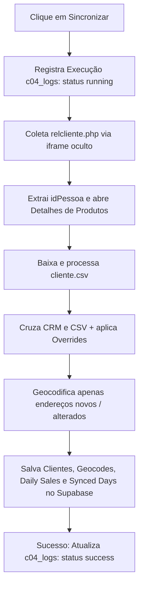
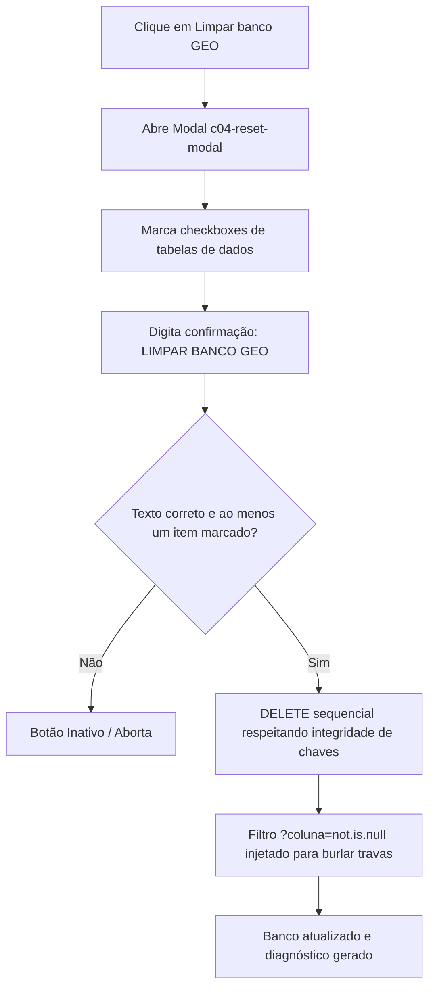

# Interfaces, Ações e Botões • Módulo GEO

Este documento apresenta a documentação visual, funcional e técnica das telas, abas e de todos os botões operacionais e de diagnóstico do módulo GEO.

---

## 🖥️ Visão Geral das Interfaces

O módulo GEO é composto por duas interfaces principais na tela do CRM:

1.  **Painel Principal (Mapa)**: Exibe os pins e clusters no Google Maps, controles laterais de filtros (frequência, ticket, score), mapa de calor (visitas, receita líquida, score), raios de seleção e o resumo estatístico geral comparado com seleções regionais.
2.  **Modal de Configurações (`#c04-settings-modal`)**: Redesenhado para ser mais amplo (`width: min(1300px, 95%)` com `padding-bottom: 60px`) para acomodar dados tabulares e relatórios legíveis. Ele possui abas de navegação direta que carregam seus respectivos painéis inline sem abrir janelas extras:
    *   **Personalização**: Parametrização de pesos e cores do Score, o Ticket médio de referência do franqueado, o raio padrão dos clusters e opacidade de mapas de calor.
    *   **Pendências**: Permite analisar incoerências de cadastro (ex-clientes sem coordenadas, divergência de rua, cidade, etc.) e executar re-scans em lote ou individuais.
    *   **Logs**: Histórico auditável de todas as execuções (Runs), detalhando data, tipo de execução, status (sucesso, erro ou cancelado), período pesquisado, duração e contadores de registros.
    *   **Diagnósticos**: Centraliza testes de infraestrutura do Supabase, rotação de logs, lista de backups lógicos e teste de APIs de mapas do Google.

---

## 🛠️ Detalhamento de Botões e Ações (Três Níveis)

---

### 1. Sincronizar (Sincronização Comum)

#### A. Fluxograma Visual (Mermaid)

#### B. Explicação Gerencial
*   **O que faz**: Atualiza os dados de faturamento e visitas dos clientes que compraram no período selecionado.
*   **Por que usar**: Para atualizar o mapa com as informações financeiras e de localização mais recentes do negócio. Ele é inteligente: não consome cota da API do Google Maps à toa, reaproveitando coordenadas de endereços que já foram geocodificados.

#### C. Detalhes Técnicos e Endpoints
1.  **Registro de Execução**: Realiza um `POST` no endpoint `/rest/v1/c04_logs` gravando a data de início (`started_at`), tipo `"sync"` e status `"running"`.
2.  **Coleta de Dados**: Carrega as páginas de `relcliente.php` no iframe oculto para extrair o `idPessoa` e detalhes de produtos de cada cliente.
3.  **Cruzamento e Geocodificação**: Efetua o matching dos dados com o `cliente.csv` baixado do CRM. Para os clientes cujos endereços mudaram ou são novos, chama a API de Geocodificação do Google.
4.  **Gravação Física**: Envia requisições `POST` com header `Prefer: resolution=merge-duplicates` para `/rest/v1/c04_customers`, `/rest/v1/c04_geocodes` e `/rest/v1/c04_daily_sales`. Habilita as datas em `/rest/v1/c04_synced_days`.
5.  **Finalização**: Atualiza o log em `/rest/v1/c04_logs?run_id=eq.RUN_ID` via `PATCH` com status `"success"` e telemetria de milissegundos.

#### D. Tratamento de Erros e Mensagens
*   **Falha de Rede ou Supabase**: Se o banco estiver fora do ar, o processo para e o log na tabela é marcado com status `"error"` com a mensagem correspondente no campo `error`.
*   **Inconsistência de Contabilidade**: Se os totais consolidados não baterem com os registros pertinentes no período, a sincronização é abortada com um alerta.

---

### 2. Central de Pendências e Ações Acopladas

A Central de Pendências exibe uma tabela inline no modal de configurações com os clientes que possuem cadastros divergentes ou que falharam na geocodificação. Ela possui ações individuais e em lote.

#### A. Ações em Lote (Checkbox Header e Seleção Múltipla)
*   **Cadastro**: Abre simultaneamente em abas separadas o cadastro dos clientes selecionados no CRM do Clube04 Digital.
*   **Tratar (Ignorar/Resolver)**: Permite definir uma justificativa e aplicar o status de ignorado ou resolvido em lote no banco.
*   **Varredura Completa (Testar Novamente em Lote)**: 
    *   **Explicação Gerencial**: Executa o re-scan pontual para todas as pendências selecionadas. Ele limpa o cache local do CSV, baixa a versão atualizada do cadastro do CRM e reexecuta em memória o cruzamento e geocodificação para as linhas marcadas, aplicando overrides em tempo real.
    *   **Explicação Técnica**: O botão `#c04-pending-full-scan` coleta os IDs de pendência selecionados e executa `retryPendings(ids)`.

#### B. Ações Individuais (Botão "Testar" por Linha)
*   **Explicação Gerencial**: Testa novamente de forma pontual a pendência daquela linha específica, consultando o CRM e tentando geocodificar seu endereço atualizado.
*   **Explicação Técnica**: Chama `retryPendings([pendingId])` para reavaliar a pendência no banco de dados e atualizar sua coordenada ou justificativa.

#### C. Recalcular Falhas de Geocodificação (`#c04-pending-retry-failed`)
*   **Explicação Gerencial**: Remove os endereços que falharam na geocodificação do cache do banco para forçar a API do Google a tentar localizá-los na próxima sincronização comum.
*   **Explicação Técnica**: Executa um `DELETE` em `/rest/v1/c04_geocodes?status=eq.failed` no Supabase e atualiza o painel de pendências.

---

### 3. Diagnósticos e Controle do Banco (Aba Diagnósticos)

A aba de Diagnósticos é segmentada em quatro seções principais:

#### Seção A: Diagnóstico Geral do Supabase
*   **Botão**: `Rodar Diagnóstico Geral` (`#c04-run-general-diagnostic`)
*   **O que faz**: Executa consecutivamente três testes de infraestrutura e consulta a RPC de métricas de armazenamento no PostgreSQL.
    1.  **Conexão Supabase**: Envia requisição `GET` para `/rest/v1/c04_settings?select=key&limit=1`.
    2.  **Integridade das Tabelas**: Compara registros órfãos ou inconsistentes em `/rest/v1/c04_customers` e `/rest/v1/c04_geocodes`.
    3.  **Teste de Escrita**: Grava, lê e deleta uma chave de teste (`diagnostic_temp`) em `c04_settings`.
    4.  **Métricas de Armazenamento (RPC)**: Chama a função RPC `c04_get_db_size()` para calcular o tamanho total do banco de dados, tamanho individual de cada tabela em bytes, quantidade de linhas, quantidade de logs e contagem de backups.

#### Seção B: Manutenção de Logs e Rotação
*   **Controles**: Campo de entrada numérica para definir a retenção de logs em meses e botões de limpeza.
*   **Rotação de Logs**: Ao sincronizar ou rodar diagnósticos, a suite verifica se existem logs mais antigos do que o limite definido (padrão 12 meses) e os apaga automaticamente via `DELETE /rest/v1/c04_logs?started_at=lt.DATALIMITE`.
*   **Expurgar Logs Manual (`#c04-prune-logs-now` / `#c04-clear-all-logs`)**: Permite forçar o expurgo manual baseado na retenção ou deletar absolutamente todos os logs.

#### Seção C: Backups de Segurança (Snapshots Lógicos)
*   **Tabela de Backups**: Lista backups persistidos na tabela `/rest/v1/c04_backups` com ID, data de criação formatada, tamanho do JSON e criador.
*   **Auto-Backup**: No startup do módulo GEO, a suite verifica se já existe um backup do dia de hoje. Se não houver, dispara a gravação silenciosa de um snapshot em segundo plano.
*   **Criar Backup Manual (`#c04-create-manual-backup`)**: Captura o estado atual de todas as tabelas e salva na tabela `c04_backups` com status `"success"`.
*   **Ações de Linha (Restaurar / Deletar)**:
    *   **Restaurar**: Solicita confirmação técnica, realiza a limpeza das tabelas de dados mantendo a integridade referencial e insere em lote os objetos salvos no snapshot.
    *   **Deletar**: Remove fisicamente a linha de backup na tabela `c04_backups`.

#### Seção D: Teste de Mapas e APIs
*   **Botão**: `Testar Mapa e APIs` (`#c04-test-map`)
*   **O que faz**: Verifica o namespace `google.maps` no navegador e testa o geocodificador nativo com uma consulta fictícia ("Sao Paulo, SP") para validar se a chave da API key do Google Maps está ativa, com cotas livres e sem bloqueios de CORS.

---

### 4. Limpar Banco GEO

#### A. Fluxograma Visual (Mermaid)

#### B. Explicação Gerencial
*   **O que faz**: Oferece uma exclusão granular e controlada dos dados armazenados no Supabase. O modal exibe uma árvore de checkboxes com:
    *   *Tabelas de dados* (Clientes, Coordenadas, Vendas, Dias, Pendências) pré-selecionadas para limpeza rápida.
    *   *Logs* e *Backups* desmarcados por padrão para evitar perda involuntária de histórico de auditoria e segurança.
*   **Confirmação**: Exige digitar exatamente a frase `LIMPAR BANCO GEO` para que o botão de execução seja habilitado.

#### C. Detalhes Técnicos e Endpoints
1.  **Exclusão Granular**: Deleta apenas as tabelas cujas caixas de seleção estavam marcadas.
2.  **Ordem de Integridade**: Respeita a ordem exata de dependências FK para evitar erros do Postgres:
    *   Filhas: `c04_daily_sales` -> `c04_geocodes`
    *   Pais: `c04_customers` -> `c04_synced_days` -> `c04_pendings` -> `c04_logs` -> `c04_backups`
3.  **Bypass do PostgREST**: O PostgREST do Supabase impede deletes sem parâmetros (`DELETE /tabela`). Para contornar a trava e permitir a limpeza completa via API REST, a suite anexa o filtro `?campo=not.is.null` (ex: `/rest/v1/c04_customers?id_pessoa=not.is.null`).

---

## 🛈 Dicas de Ajuda e Informações (i)

Cada botão e campo de configuração no modal possui um ícone de informação `(i)` com tooltips detalhadas. Ao passar o mouse, a suite exibe explicações em português do impacto técnico e gerencial daquela funcionalidade, garantindo a autonomia operacional do franqueador.
