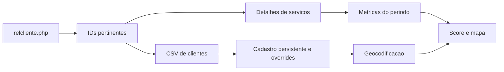

# Funcionamento do Modulo GEO

## Objetivo

O modulo GEO transforma o relatorio comercial de um periodo em uma visualizacao geografica. Nenhum cadastro original do Clube04 e alterado. A planilha externa guarda somente informacoes persistentes; visitas, gasto, ticket e score existem somente durante a consulta atual.

## Sincronizacao

1. O usuario informa o periodo e clica em `Sincronizar`.
2. O modulo abre `relcliente.php` em um iframe oculto e coleta todas as paginas.
3. O `idPessoa` e extraido do comando `detalhesProdutoCliente`.
4. Para cada cliente pertinente, o modulo abre o detalhe de produtos e percorre todas as paginas.
5. O CSV completo de `cliente.php` e baixado uma unica vez.
6. Na coluna `Cliente`, somente o texto anterior ao primeiro ` ` e considerado tutor. Pets exibidos depois do ` ` sao ignorados.
7. O CSV nao possui `idPessoa`. O cruzamento automatico exige nome completo e telefone exatos apos normalizacao.
8. O telefone usa somente o trecho depois do ultimo separador `- ` e e persistido somente com digitos.
9. Tutor com telefone vazio pode cruzar somente quando o CSV tambem possui telefone vazio e representa um unico cadastro persistente consistente.
10. O `relcliente.php` da unidade autenticada e autoritativo para pertinencia.
11. O CSV complementa cadastro, pets e endereco. Pets do relatorio nunca populam o banco. Unidade nao participa da validacao.
12. Somente clientes explicitamente inativos no CSV sao rejeitados.
13. Quando o CSV nao encontra o cliente, um cadastro minimo e criado com `idPessoa`, nome e contato do relatorio.
14. Cadastro, pets e endereco sao comparados com o snapshot persistente.
15. Overrides GEO auditados sao aplicados antes da comparacao e da geocodificacao.
16. Coordenadas validas e falhas persistidas sao reutilizadas quando o hash do endereco nao mudou.
17. Enderecos novos ou alterados sao enviados para geocodificacao. A varredura completa tambem repete falhas do periodo.
18. Os dados persistentes sao preparados em `Staging` com uma nova `datasetVersion`.
19. A nova versao somente fica ativa quando todas as validacoes terminam e `Meta.activeVersion` e trocada.

Toda execucao deve satisfazer `pertinentes = aceitos + rejeitados`. Caso contrario, a publicacao e bloqueada.

Clientes persistentes que nao aparecem no periodo permanecem na versao seguinte, mas nao sao revalidados e nao aparecem no mapa.

## Sincronizar e varredura completa

- `Sincronizar`: reutiliza coordenadas validas e falhas persistidas. Falhas somente sao repetidas quando endereco ou CEP mudou, ou quando uma resolucao manual solicita nova tentativa.
- `Varredura completa`: refaz a coleta do periodo e repete apenas geocodificacoes falhas. Coordenadas validas continuam preservadas.
- Acima de 999 consultas estimadas, a interface exige confirmacao antes da geocodificacao.

## Metricas do periodo

- Visitas: valor de `Num. Compras` em `relcliente.php`.
- Frequencia: quantidade de dias informada em `Freq. Compras`.
- Valor de servicos realizados: soma dos valores dos produtos, excluindo produtos cujo nome contenha a palavra inteira normalizada `pacote`.
- Ticket de servicos realizados: valor dos servicos realizados dividido pelo numero de visitas. Nao representa necessariamente o valor pago no caixa.
- Ultima compra: data informada em `relcliente.php`.

Clientes sem visitas e sem gasto liquido nao aparecem no mapa.

## Score

O score padrao usa recorrencia continua com peso de 60% e ticket de servicos realizados com peso de 40%.

| Dias | Nota de recorrencia |
| --- | --- |
| 0 | 100 |
| 7 | 85 |
| 15 | 60 |
| 30 | 25 |
| 60 ou mais | 0 |

Valores intermediarios sao interpolados continuamente. Assim, quatro dias pontuam melhor que sete dias.

A recorrencia e classificada como:

- Ate 7 dias: Excelente.
- De 8 a 15 dias: Bom.
- De 16 a 30 dias: Precisa melhorar.
- Acima de 30 dias: Ruim.

Clientes com uma visita sao classificados como `Primeira visita`, recebem baixa confianca e usam somente o ticket no score. Podem ser ocultados por filtro.

Pesos, limites, ticket de referencia e cores podem ser alterados em Configuracoes.

## Dados persistentes

- `Clientes`: uma linha por `idPessoa` e versao ativa, com identidade e endereco original estruturado.
- `Pets`: uma linha por pet e versao ativa, relacionada por `idPessoa`.
- `Geocodificacao`: endereco de entrada, endereco resolvido, CEP, coordenadas, qualidade, falhas e status.
- `Overrides`: correcoes locais auditadas de endereco, relacionamento e repeticao de geocodificacao.
- `Pendencias` e `ResolucaoPendencias`: problemas e auditoria de tratamento.
- `Execucoes` e `LogDetalhado`: historico operacional.
- `Configuracoes` e `Meta`: pares chave/valor legiveis.
- `Staging`: area tecnica temporaria usada para montar a proxima versao.

A publicacao e feita por versao ativa. Uma falha antes da troca de `Meta.activeVersion` preserva integralmente a versao anterior. As duas versoes mais recentes sao mantidas.

Metricas do periodo nao sao gravadas em `Clientes`.

## Mapa

- Pins representam clientes ativos no periodo.
- O pin da loja e laranja e separado dos clientes.
- Clusters agrupam clientes proximos.
- Heatmaps de visitas, valor de servicos realizados e score podem ser sobrepostos.
- Um unico Map ID JavaScript controla o estilo principal. Satelite e uma camada de contexto independente.
- O controle em formato de alvo recentraliza no Clube04.
- A selecao regional suporta varios raios, quadrados e poligonos. O resultado e a uniao das areas.
- Filtros de frequencia, ticket e score afetam pins, clusters, heatmaps, indicadores, selecoes e exportacao. Frequencia ausente nao entra em uma faixa de frequencia.
- O resumo geral representa todos os pins filtrados. O resumo da selecao permite comparar a fatia selecionada com o total.

## Pendencias e diagnosticos

Pendencias permitem abrir o cadastro original em nova guia, criar um override GEO, repetir geocodificacao ou ignorar com justificativa. O modulo nao grava alteracoes no Clube04.

O diagnostico geral executa conexao, escrita artificial com limpeza, staging artificial com descarte, mapa, Map ID, geocodificacao artificial, coleta e consistencia. Exibe resumo humano e detalhes tecnicos recolhidos.

## Resultados de publicacao

| Resultado | Comportamento |
| --- | --- |
| `success` | Clientes validos publicados sem pendencias. |
| `success_with_pendings` | Nova versao e pendencias publicadas, inclusive quando nenhum cliente e mapeavel. |
| `empty_period` | Nenhum cliente no periodo; base persistente preservada. |
| `error` | Coleta parcial, contabilizacao inconsistente ou falha operacional. |

## Reconstrucao do banco GEO

O banco antigo somente e limpo por uma acao avancada protegida. A interface usa um modal interno, mostra uma previa e exige a frase `LIMPAR BANCO GEO`. A sincronizacao comum nunca executa essa limpeza.

## Limites conhecidos

- Nao existem poligonos de bairros ou distritos nesta versao.
- O nome do bairro vem da geocodificacao.
- A planilha e publica por decisao operacional e contem dados pessoais. O acesso deve ser revisto periodicamente.
- A chave Maps e publica no navegador e deve permanecer restrita por referenciador, APIs e cotas.
- O nucleo persistente ativo e protegido pela troca de `Meta.activeVersion`. Logs e pendencias operacionais nao possuem uma transacao nativa do Google Sheets.
