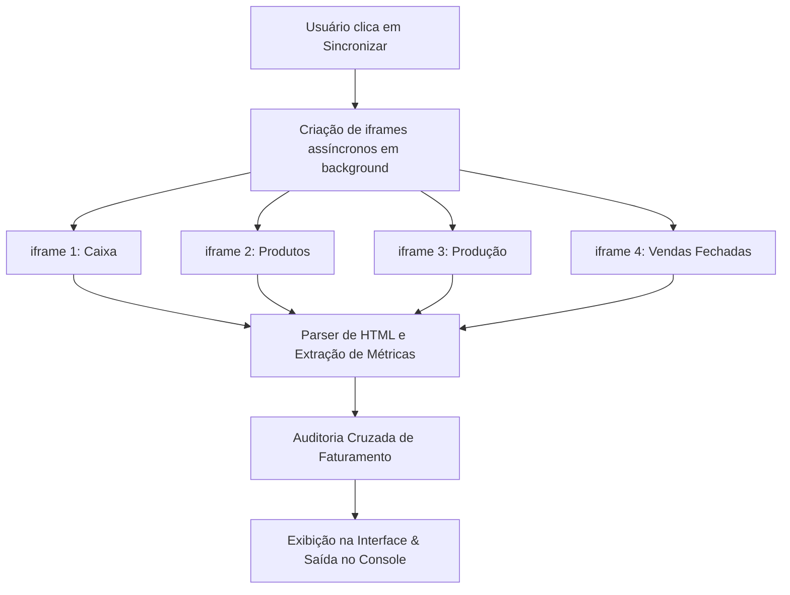

# Módulo Metas • Deep Analytics de Faturamento

O módulo **Metas** é o painel de análise profunda de faturamento e desempenho comercial da Suite Central Clube04. Ele foi desenhado para consolidar relatórios dispersos no CRM de forma ágil e segura em segundo plano.

---

## 📈 Proposta do Módulo

O módulo automatiza a coleta e o cruzamento cruzado de dados financeiros e operacionais para monitorar metas corporativas. Ele calcula indicadores essenciais sem exigir que o franqueado exporte manualmente vários relatórios do CRM e execute cruzamentos em planilhas externas.

---

## 🔌 Fluxo de Raspagem de Dados (Scrape)

Para gerar os indicadores, a suite abre **iframes ocultos temporários** que carregam de forma assíncrona quatro relatórios nativos do CRM:

1.  **Caixa (`relatoriocaixa.php`)**: Fornece o fechamento financeiro oficial e fluxo de caixa de caixas abertos e fechados.
2.  **Produto (`relproduto.php`)**: Coleta a quantidade e faturamento bruto e líquido de vendas de itens de pet shop/produtos físicos da loja.
3.  **Produção de Vendas (`relproducaovenda.php`)**: Informa a produção individualizada de banhos, tosas, banhos para tosar e serviços adicionais por colaborador.
4.  **Vendas Fechadas (`relvendafechada.php`)**: Fornece o faturamento líquido consolidado e o total de pacotes contratados/vendidos.

*Todos os iframes são removidos fisicamente do DOM imediatamente após a conclusão da leitura.*

---

## 🛡️ Alertas de Auditoria e Divergências

Para garantir a confiabilidade das informações financeiras, o módulo Metas executa uma **auditoria cruzada em memória** comparando o faturamento líquido de diferentes relatórios:
*   Se a diferença de faturamento líquido entre os relatórios ultrapassar as margens aceitáveis ($>2.5\%$), o painel exibe um bloco laranja de **Alertas de Auditoria** indicando a divergência em porcentagem e valores absolutos.
*   Isso ajuda a identificar erros humanos (ex: lançamento incorreto de serviços sem caixa correspondente ou falhas de baixa no CRM).

---

## 🖥️ Ações e Controles da Interface

*   **Sincronizar Dados (Botão Principal)**: Dispara o fluxo de abertura de iframes ocultos para a data ou período selecionado.
*   **Buscar por Período (Checkbox)**: Permite selecionar uma única data ou uma faixa de datas (Data Início até Data Fim).
*   **Copiar Valores (Botão Sucesso)**: Copia os valores consolidados em formato amigável direto para a área de transferência do usuário, facilitando colá-los em planilhas de metas.
*   **Relatório no Console (F12)**: O módulo possui um debugger integrado (`Debugger.printAll()`) que imprime tabelas ricas formatadas no console do navegador (F12), permitindo auditar cada produto e colaborador individualmente por subcategorias (banhos, tosas, pacotes, loja).
