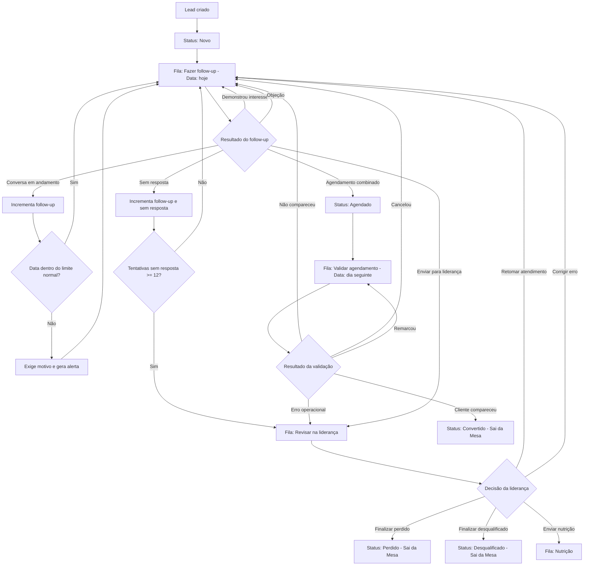
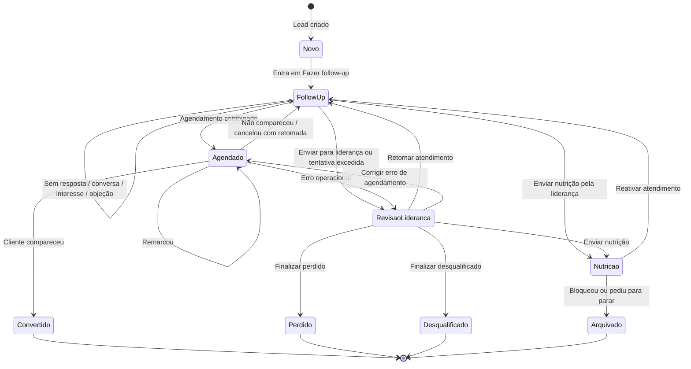

# Ciclo Operacional do Lead — Decisões v4

> Documento de trabalho para orientar o protótipo da Mesa Operacional do Clube04.
> Escopo: Jornada do Lead, Mesa Operacional, follow-up, validação de agendamento, nutrição e revisão da liderança.
> Este documento ainda não é contrato oficial do CRM real até ser validado e versionado nos docs do repositório principal.

---

## 1. Conceito central

A Mesa Operacional não deve exibir diretamente apenas `status`, `próxima ação` ou `resultado`.

A lógica correta é:

```text
Fila operacional / tarefa atual
→ equipe executa atendimento
→ informa resultado da interação
→ informa detalhe/motivo quando necessário
→ sistema gera novo status, nova fila, nova data, tags, auditoria e ações secundárias
```

Definições:

| Conceito | Pergunta que responde | Exemplo |
|---|---|---|
| Status | Em que fase o lead está? | Novo, Follow-up, Agendado, Revisão da liderança, Convertido |
| Fila operacional / tarefa atual | O que precisa ser feito agora? | Fazer follow-up, Validar agendamento, Revisar na liderança, Nutrição |
| Resultado da interação | O que aconteceu quando a tarefa foi executada? | Sem resposta, Demonstrou interesse, Agendamento combinado |
| Detalhe/motivo | Qual camada explica o resultado? | Pediu preço, mora longe, pet reativo |
| Situação operacional calculada | Qual é a leitura prioritária para a Mesa? | Hoje, Atrasado 3d, Backlog 14d, Tentativa alta |
| Tags secundárias | Quais alertas complementam a leitura? | Sem resposta, Tentativa 8/12, Banho e tosa |

---

## 2. Regras obrigatórias

1. Lead ativo sempre precisa ter:
   - fila operacional / tarefa atual;
   - data de próxima ação;
   - responsável.

2. Lead terminal não pode ter:
   - fila operacional;
   - data de próxima ação.

3. Lead terminal não aparece na Mesa Operacional diária.

4. `Novo lead` não é fila operacional.
   - É apenas status inicial quando o lead é criado.
   - Após cadastro, o lead entra na fila `Fazer follow-up` com data de próxima ação para hoje.

5. `Aguardando resposta`, `Retomar atendimento` e `Sem próxima ação` não serão filas.
   - Esses conceitos serão tratados por resultado, tags, situação calculada ou ação dentro do fluxo.

6. `Sem resposta` não é status nem fila.
   - É resultado de interação.
   - Gera incremento de tentativa sem resposta e nova data pela cadência.

7. `Perdido` e `Desqualificado` só podem ser finalizados pela liderança.

8. Objeções devem ser contornadas no atendimento.
   - Objeção não deve ir automaticamente para liderança.
   - Liderança entra em caso sensível, erro operacional, desqualificação, tentativa excedida ou exceção real.

9. Próxima data de follow-up fora do espaçamento normal exige motivo e gera alerta para liderança.

10. Follow-up com prazo muito longo não deve ser tratado como follow-up comum.
    - Acima de 15 dias deve ir para `Nutrição` ou `Revisão da liderança`, salvo override de liderança/admin.

---

## 3. Status do lead

| Status | Descrição | Aparece na Mesa? |
|---|---|---|
| Novo | Lead recém-criado | Sim, via fila Fazer follow-up |
| Follow-up | Lead em atendimento/cadência | Sim |
| Agendado | Lead com agendamento combinado | Sim, via fila Validar agendamento |
| Revisão da liderança | Lead enviado para decisão de liderança | Sim |
| Nutrição | Lead em fila de campanha/nutrição | Sim, em fila/visão própria |
| Convertido | Virou cliente | Não |
| Perdido | Lead válido que não converteu | Não |
| Desqualificado | Lead inválido/inviável | Não |
| Arquivado / Não contatar | Lead bloqueou ou pediu para parar | Não |

---

## 4. Filas operacionais / tarefas atuais

| Fila | Uso operacional | Observação |
|---|---|---|
| Fazer follow-up | Atendimento ativo, lead novo, conversa em andamento, sem resposta, interesse ou objeção | Fila principal da operação diária |
| Validar agendamento | Lead que teve agendamento combinado e precisa validar desfecho | Aparece no dia seguinte ao agendamento |
| Revisar na liderança | Exceções, tentativa excedida, desqualificação/perda, caso sensível, erro operacional | Exige checklist e motivo |
| Nutrição | Campanhas, eventos, rebranding, listas e reativação futura | Deve existir como fila/visão própria, mas não deve poluir a operação diária |

---

## 5. Dois contadores separados

O sistema deve manter dois contadores distintos.

| Contador | Incrementa quando | Tem limite? | Uso |
|---|---|---:|---|
| Tentativas sem resposta | Resultado = Sem resposta | Sim, 12 | Controla cadência e envio para liderança |
| Tentativas de follow-up | Qualquer follow-up executado com registro de resultado | Não | Análise gerencial de esforço, cadência, conversão e produtividade |

Regras:

1. `tentativas_sem_resposta` incrementa apenas quando o resultado registrado for `Sem resposta`.
2. `tentativas_follow_up` incrementa sempre que uma tarefa da fila `Fazer follow-up` for executada e registrada.
3. Uma conversa com resposta do tutor não deve aumentar `tentativas_sem_resposta`.
4. `tentativas_follow_up` não tem limite automático, mas pode gerar análises futuras.
5. A liderança deve conseguir ver os dois contadores.

Exemplo:

```text
Follow-up executado: Demonstrou interesse
→ tentativas_follow_up +1
→ tentativas_sem_resposta não muda

Follow-up executado: Sem resposta
→ tentativas_follow_up +1
→ tentativas_sem_resposta +1
```

---

## 6. Cadência de sem resposta

A cadência de sem resposta tem limite de 12 tentativas. Ao completar o ciclo sem resposta, o lead deve ir para revisão da liderança.

| Tentativa sem resposta | Prazo padrão | Tipo sugerido |
|---:|---|---|
| 1 | D0 imediato | Mensagem inicial |
| 2 | D0 mais tarde, 18:00 | Reforço curto |
| 3 | D+1 manhã, 09:30 | Mensagem curta |
| 4 | D+1 almoço, 12:30 | Áudio |
| 5 | D+1 tarde, 16:30 | Vídeo |
| 6 | D+3, 09:30 | Ligar + mensagem |
| 7 | D+6 manhã, 09:30 | Follow-up |
| 8 | D+6 almoço, 12:30 | Áudio/prova social |
| 9 | D+6 tarde, 16:30 | Vídeo/oferta contextual |
| 10 | D+7 manhã, 09:30 | Última tentativa curta |
| 11 | D+7 tarde, 16:30 | Encerramento/nutrição |
| 12 | Após ciclo completo | Enviar para liderança |

Regras:

1. Se o tutor responder, a cadência de sem resposta é interrompida.
2. Se depois a conversa esfriar, o lead continua em `Fazer follow-up`, mas não necessariamente zera o contador de sem resposta.
3. O limite de 12 é fixo para a primeira versão.
4. A cadência pode ser configurável no futuro, mas não deve variar por origem/campanha agora.

---

## 7. Espaçamento máximo da próxima data de follow-up

Quando a equipe define manualmente a próxima data da fila `Fazer follow-up`, o sistema deve analisar o espaçamento em relação ao momento atual.

Objetivo:

```text
Evitar que lead ativo fique parado por muitos dias sem justificativa.
```

### 7.1 Limite normal por estágio

| Tentativa de follow-up | Prazo máximo normal | Observação |
|---:|---:|---|
| 1 a 2 | 2 dias | Lead ainda quente; espaçamento maior reduz conversão |
| 3 a 4 | 4 dias | Ainda há chance ativa de conversão |
| 5 a 6 | 5 dias | Follow-up pode ser mais espaçado |
| 7 ou mais | 6 dias | Limite normal máximo para follow-up ativo |

### 7.2 Regras de validação

| Condição | Comportamento |
|---|---|
| Data dentro do limite normal | Permitir sem motivo extra |
| Data acima do limite normal e até 15 dias | Permitir com motivo obrigatório e gerar alerta para liderança |
| Data acima de 15 dias | Bloquear para atendente e orientar mover para Nutrição ou Revisão da liderança |
| Data acima de 15 dias por líder/admin | Permitir apenas com motivo obrigatório e alerta crítico |

### 7.3 Motivos para espaçamento acima do normal

Motivos sugeridos:

```text
Tutor pediu retorno em data específica
Tutor viajando
Aguardando decisão familiar
Aguardando pagamento
Aguardando definição de agenda
Lead pediu para chamar depois
Outro motivo justificado
```

### 7.4 Alerta para liderança

Quando houver follow-up fora do espaçamento normal, gerar flag:

```text
follow_up_gap_warning = true
follow_up_gap_days = número de dias
follow_up_gap_reason = motivo informado
```

Essa flag deve aparecer:

- no card, como tag secundária se estiver entre as mais prioritárias;
- no drawer do lead;
- em filtro futuro de liderança;
- no histórico/auditoria.

Tag sugerida:

```text
Follow-up longo 12d
```

---

## 8. Resultados por fila

### 8.1 Fazer follow-up

| Resultado | Segunda camada | Terceira camada quando necessário | Efeito esperado |
|---|---|---|---|
| Sem resposta | Não visualizou, visualizou e não respondeu, chamada não atendida | Opcional | Mantém em Fazer follow-up, incrementa contadores, agenda pela cadência |
| Conversa em andamento | Tirou dúvida, pediu para chamar depois, pediu opinião de familiar | Opcional | Mantém em Fazer follow-up, exige nova data |
| Demonstrou interesse | Banho, tosa, banho e tosa, pacote, hidratação, ozônio, tosa higiênica | Pediu preço, pediu horário, perguntou experiência, perguntou pacote | Mantém em Fazer follow-up, exige nova data ou agendamento |
| Objeção | Preço, localização, sem táxi dog, medo/experiência anterior, quer raspar, agenda | Detalhe livre | Mantém em Fazer follow-up; objeção deve ser contornada |
| Agendamento combinado | Serviço previsto, data do agendamento, cadastro completo/incompleto | Opcional | Move para Validar agendamento |
| Enviar para liderança | Checklist + categoria/motivo/detalhe | Obrigatório | Move para Revisar na liderança |

Atendente não deve finalizar diretamente como perdido/desqualificado.

### 8.2 Validar agendamento

| Resultado | Segunda camada | Efeito esperado |
|---|---|---|
| Cliente compareceu | Serviço realizado | Status Convertido, sai da Mesa |
| Cliente não compareceu | Sem aviso, avisou em cima da hora, confundiu data | Volta para Fazer follow-up com motivo e data obrigatória |
| Cancelou | Preço, agenda, pet, localização, outro | Volta para Fazer follow-up ou liderança conforme motivo |
| Remarcou | Nova data do agendamento | Continua em Validar agendamento com nova data de validação |
| Agendamento não localizado | Erro de agenda/cadastro | Vai para Revisar na liderança |
| Erro operacional | Data divergente, responsável incorreto, cadastro incompleto | Vai para Revisar na liderança |

### 8.3 Revisar na liderança

| Resultado/decisão | Campos obrigatórios | Efeito esperado |
|---|---|---|
| Retomar atendimento | Orientação, responsável, data | Volta para Fazer follow-up |
| Finalizar como perdido | Motivo | Status Perdido, sai da Mesa |
| Finalizar como desqualificado | Motivo nível 1/2/3 | Status Desqualificado, sai da Mesa |
| Enviar para nutrição | Motivo e janela/campanha | Status Nutrição, entra em fila/visão de Nutrição |
| Corrigir erro operacional | Correção feita, próxima fila/data | Volta para Follow-up ou Validar agendamento |
| Gerar ação secundária | Tipo, responsável, prazo | Mantém ou finaliza conforme decisão principal |

### 8.4 Nutrição

| Resultado/decisão | Campos obrigatórios | Efeito esperado |
|---|---|---|
| Manter em nutrição | Próxima campanha/data | Continua em Nutrição |
| Reativar atendimento | Motivo e data | Volta para Fazer follow-up |
| Remover da nutrição | Motivo | Vai para Arquivado ou outro terminal definido |
| Bloqueou / pediu para parar | Motivo | Status Arquivado / Não contatar |

---

## 9. Cadastro necessário para agendamento

A coleta completa de cadastro deve ser uma etapa ligada ao resultado `Agendamento combinado`, não ao cadastro inicial do lead.

Mensagem operacional de referência:

```text
Perfeito!! Agora só preciso dos seguintes dados para finalizar o cadastro e agendar o primeiro banho: 🤩

* Nome completo do Tutor:
* Data de nascimento do Tutor:
* CPF:
* Email:
* Endereço completo com CEP:

* Nome do doguinho:
* Tem raça definida?
* Peso aproximado:
* Data de nascimento (ou idade):
* É castrado?
* Com que frequência toma banho?
* Existe alguma observação importante sobre saúde/manejo?
(ex.: uso de medicamentos, ansioso, reativo, limitações motoras, pele sensível, nós/embolo)

* Como conheceu o Clube04? Se for indicação, coloque o nome ou parceiro:
```

Campos preparados:

### Tutor

```text
Nome completo
Data de nascimento
CPF
Email
CEP
Endereço completo
Como conheceu o Clube04
Nome da indicação/parceiro
```

### Doguinho

```text
Nome
Raça definida?
Raça
Peso aproximado
Data de nascimento ou idade
Castrado?
Frequência de banho
Saúde/manejo
```

Regra inicial:

- No protótipo, `Agendamento combinado` pode ser salvo com cadastro incompleto, mas deve gerar alerta `Cadastro incompleto para agendamento`.
- No CRM real, a decisão de bloquear ou permitir dependerá da integração com agenda/ERP.

---

## 10. Revisão da liderança

### 10.1 Checklist obrigatório para envio

Antes de enviar para liderança, a equipe deve confirmar:

```text
[ ] Houve tentativa real de contato pelo WhatsApp
[ ] O telefone parece válido
[ ] Existe observação suficiente para a liderança entender
[ ] O caso não pode ser resolvido apenas com novo follow-up
[ ] Foi selecionado motivo operacional em 3 níveis
```

### 10.2 Motivos em 3 níveis

Formato:

```text
Categoria > Motivo > Detalhe
```

Categorias iniciais:

```text
Desqualificado
Perdido
Caso sensível
Erro operacional
Tráfego / qualidade do lead
Opt-out
```

Exemplos:

```text
Desqualificado > Fora da região > Não quis táxi dog
Desqualificado > Dados inválidos > Telefone inválido
Perdido > Preço > Achou caro
Caso sensível > Pet exige cuidado > Reativo/agressivo
Erro operacional > Agendamento > Data divergente
Tráfego > Lead ruim > Não tem pet
Opt-out > Comunicação > Pediu para parar
```

---

## 11. Permissões

| Ação | Atendente | Líder | Admin |
|---|---:|---:|---:|
| Registrar resultado de follow-up | Sim | Sim | Sim |
| Registrar sem resposta | Sim | Sim | Sim |
| Agendamento combinado | Sim | Sim | Sim |
| Validar agendamento | Sim | Sim | Sim |
| Enviar para liderança | Sim | Sim | Sim |
| Retomar da liderança | Não | Sim | Sim |
| Finalizar perdido | Não | Sim | Sim |
| Finalizar desqualificado | Não | Sim | Sim |
| Enviar para nutrição | Não | Sim | Sim |
| Reabrir terminal | Não | Sim | Sim |
| Override de follow-up acima de 15 dias | Não | Sim | Sim |
| Ver detalhes técnicos | Não | Não | Sim |

---

## 12. Ações secundárias

A liderança pode gerar ações secundárias para gestão.

Tipos iniciais:

```text
Reportar tráfego pago
Revisar atendimento interno
Corrigir cadastro
Corrigir agendamento
Revisar caso sensível
```

Exemplo:

```text
Desqualificado > Fora da região > Não quis táxi dog
→ gerar ação: Reportar tráfego pago
→ modo: manual por enquanto
```

---

## 13. Filtros superiores sugeridos

Para a v6, usar uma primeira linha de filtros principais, sem filtros combináveis ainda.

| Filtro | Critério |
|---|---|
| Todos ativos | Leads com fila operacional ativa |
| Hoje | Data de próxima ação hoje |
| Atrasados | Data vencida, mas ainda não backlog |
| Backlog | Vencidos acima do limite configurado |
| Próximos 7 dias | Próximas ações futuras até 7 dias |
| Validar agendamento | Fila = Validar agendamento |
| Liderança | Fila = Revisar na liderança |
| Nutrição | Fila = Nutrição |
| Tentativa alta | Tentativas sem resposta próximas do limite |

Filtros combináveis para v7:

```text
Responsável
Origem
Interesse
Alerta pet
Último resultado
Follow-up longo
Cadastro incompleto
```

---

## 14. Situação principal — ranking de prioridade

O card deve mostrar apenas uma situação principal, calculada por prioridade.

| Prioridade | Situação principal | Quando aparece |
|---:|---|---|
| 1 | Erro de consistência | Lead ativo sem fila/data, terminal com fila/data ou dado incompatível |
| 2 | Caso sensível | Flag de caso sensível, pet agressivo/reativo grave ou reclamação |
| 3 | Revisão da liderança | Fila = Revisar na liderança |
| 4 | Backlog Xd | Vencido acima do limite de backlog |
| 5 | Atrasado Xd | Vencido, mas ainda não backlog |
| 6 | Validar agendamento hoje | Fila = Validar agendamento e data hoje |
| 7 | Hoje | Próxima ação hoje |
| 8 | Follow-up longo | Próxima data acima do limite normal com motivo |
| 9 | Tentativa alta | Tentativas sem resposta próximas do limite |
| 10 | Cadastro incompleto | Agendamento combinado sem cadastro completo |
| 11 | Nutrição | Fila = Nutrição |
| 12 | Próximos 7 dias | Data futura até 7 dias |
| 13 | Novo | Status = Novo |
| 14 | Futuro | Data futura acima de 7 dias |

Regra:

```text
Se várias situações forem verdadeiras, exibir apenas a de menor número de prioridade.
```

---

## 15. Tags secundárias — ranking de prioridade

Mostrar no máximo 3 tags secundárias no card.

| Prioridade | Tipo | Exemplos |
|---:|---|---|
| 1 | Último resultado | Sem resposta, Demonstrou interesse, Não compareceu |
| 2 | Tentativa sem resposta | Tentativa 8/12, Última tentativa |
| 3 | Follow-up | Follow-up 5, Follow-up longo 12d |
| 4 | Interesse comercial | Banho e tosa, Pacote, Ozônio |
| 5 | Alerta do doguinho | Reativo, Agressivo, Pele sensível |
| 6 | Motivo de liderança | Fora da região, Erro operacional |
| 7 | Cadastro | Cadastro incompleto |
| 8 | Origem | Meta Ads Instagram, Google Pesquisa |
| 9 | Responsável | Cauê, Etiene, Atendente |

Origem e responsável devem ser usados preferencialmente em filtros, não como tag fixa, para reduzir poluição visual.

---

## 16. Reabertura de lead terminal

Regra:

1. Apenas liderança/admin pode reabrir lead terminal.
2. Motivo obrigatório.
3. A origem da reabertura deve ser registrada.
4. Se o lead entrou em contato por vontade própria, pode voltar para `Fazer follow-up`.
5. Ao reabrir:

```text
status = Follow-up
fila = Fazer follow-up
data_proxima_acao = hoje/agora
tentativas_sem_resposta não zera automaticamente
tentativas_follow_up continua histórico
```

Se estava em Nutrição e pediu para parar ou bloqueou:

```text
status = Arquivado / Não contatar
fila = null
data_proxima_acao = null
motivo = Opt-out
```

---

## 17. Fluxo principal



---

## 18. Máquina de estados



---

## 19. Matriz de decisão resumida

| Fila atual | Resultado | Campos obrigatórios | Novo status | Nova fila | Data obrigatória | Sai da Mesa diária? |
|---|---|---|---|---|---:|---:|
| Fazer follow-up | Sem resposta | Não | Follow-up | Fazer follow-up | Sim, pela cadência | Não |
| Fazer follow-up | Conversa em andamento | Próxima data | Follow-up | Fazer follow-up | Sim | Não |
| Fazer follow-up | Demonstrou interesse | Interesse + próxima data ou agendamento | Follow-up | Fazer follow-up | Sim | Não |
| Fazer follow-up | Objeção | Tipo de objeção + próxima data | Follow-up | Fazer follow-up | Sim | Não |
| Fazer follow-up | Agendamento combinado | Data do agendamento | Agendado | Validar agendamento | Sim, automática | Não |
| Fazer follow-up | Enviar liderança | Checklist + motivo 1/2/3 | Revisão liderança | Revisar liderança | Sim | Não |
| Validar agendamento | Cliente compareceu | Serviço realizado | Convertido | Nenhuma | Não | Sim |
| Validar agendamento | Não compareceu | Motivo + próxima data | Follow-up | Fazer follow-up | Sim | Não |
| Validar agendamento | Remarcou | Nova data | Agendado | Validar agendamento | Sim | Não |
| Validar agendamento | Erro operacional | Descrição | Revisão liderança | Revisar liderança | Sim | Não |
| Revisar liderança | Retomar atendimento | Orientação + data | Follow-up | Fazer follow-up | Sim | Não |
| Revisar liderança | Finalizar perdido | Motivo | Perdido | Nenhuma | Não | Sim |
| Revisar liderança | Finalizar desqualificado | Motivo 1/2/3 | Desqualificado | Nenhuma | Não | Sim |
| Revisar liderança | Enviar nutrição | Motivo + janela | Nutrição | Nutrição | Sim | Não, mas sai da rotina diária |
| Nutrição | Reativar atendimento | Motivo + data | Follow-up | Fazer follow-up | Sim | Não |
| Nutrição | Bloqueou/pediu parar | Motivo | Arquivado | Nenhuma | Não | Sim |

---

## 20. Decisões fechadas nesta revisão

1. Mesa deve ser organizada por fila operacional/tarefa atual, não por resultado.
2. Resultado da interação é o fechamento da tarefa executada.
3. Status é consequência gerada pelo sistema.
4. Situação principal e tags secundárias serão calculadas por ranking de prioridade.
5. Filas da v6: Fazer follow-up, Validar agendamento, Revisar na liderança, Nutrição.
6. Nutrição existe como fila/visão própria, mas não deve poluir a operação diária.
7. Perdido e Desqualificado só podem ser finalizados por liderança/admin.
8. Objeção é tratada no follow-up, não vai automaticamente para liderança.
9. Cadência de sem resposta terá 12 tentativas fixas na primeira versão.
10. O sistema terá dois contadores: tentativas sem resposta e tentativas de follow-up.
11. Tentativas de follow-up não têm limite; servem para análise operacional.
12. Próxima data de follow-up fora do prazo normal exige motivo e gera alerta para liderança.
13. Prazo máximo normal de follow-up ativo é 6 dias.
14. Acima de 15 dias não é follow-up comum; deve ir para Nutrição ou Revisão da liderança, salvo override de líder/admin.
15. Agendamento combinado pode gerar alerta de cadastro incompleto no protótipo, sem bloquear.
16. Reabertura de terminal somente liderança/admin, com motivo obrigatório.
17. Reporte para tráfego pago será manual por enquanto.
