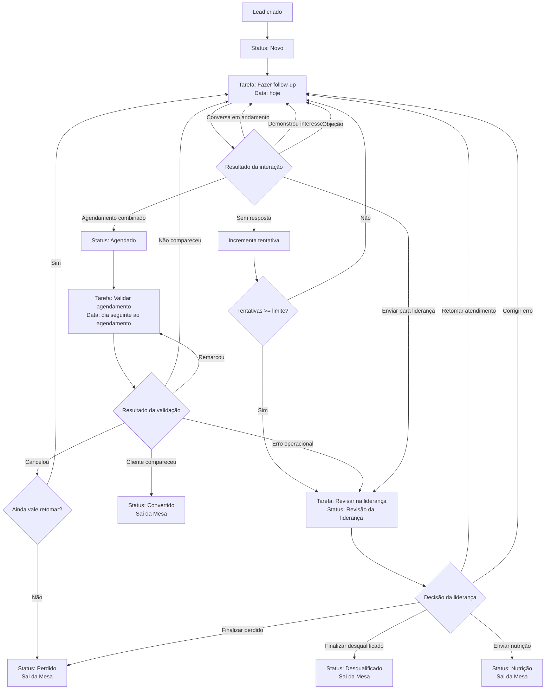
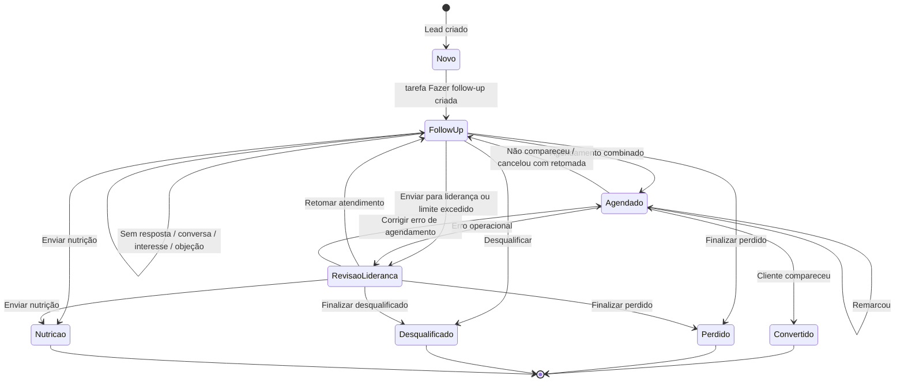
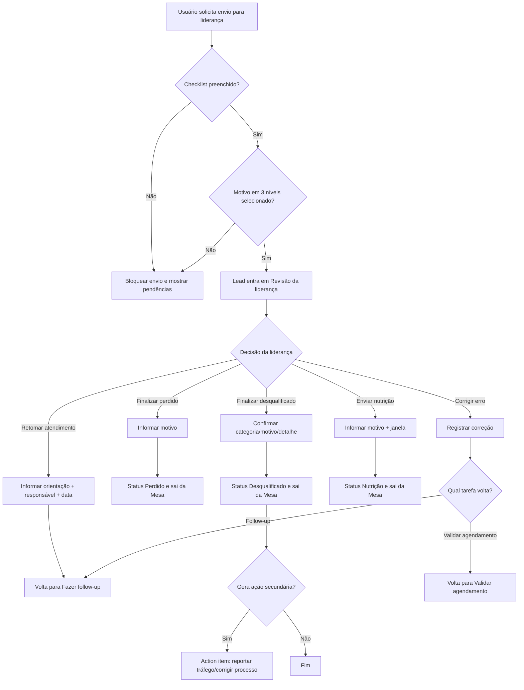

# Ciclo Operacional do Lead — Modelo de Status, Tarefas, Resultados e Decisões

**Projeto:** CRM Clube04 Mogi das Cruzes  
**Tipo:** Documento de produto/regra operacional  
**Status:** Rascunho para discussão  
**Milestone relacionada:** M1 — Jornada do Lead / M2 — Mesa Operacional  
**Data:** 2026-06-06

---

## 1. Objetivo

Este documento define o modelo operacional do ciclo do lead no CRM Clube04, com foco na rotina real da unidade de Mogi das Cruzes.

O objetivo é separar claramente:

- o que **precisa acontecer agora** com o lead;
- o que **aconteceu** na última interação;
- em que **fase operacional** o lead está;
- como o sistema deve calcular a situação exibida na Mesa Operacional;
- quais transições são permitidas;
- quais informações são obrigatórias para cada decisão;
- quais eventos devem gerar auditoria e ações secundárias.

A Mesa Operacional não deve ser um kanban genérico. Ela deve ser um painel de execução diária, priorização e disciplina de atendimento para leads oriundos principalmente de tráfego pago, WhatsApp, Google, indicação e ações locais.

---

## 2. Princípio central

O ciclo do lead deve seguir a lógica:

```text
Tarefa atual
→ equipe executa a tarefa
→ registra resultado da interação
→ sistema aplica regras
→ sistema gera status, próxima tarefa, data, tags, auditoria e possíveis ações secundárias
```

Definição resumida:

| Conceito | Pergunta respondida | Quem define |
|---|---|---|
| **Tarefa atual / fila operacional** | O que alguém precisa fazer agora? | Sistema, com ajustes controlados pelo usuário |
| **Resultado da interação** | O que aconteceu quando a tarefa foi executada? | Usuário |
| **Status do lead** | Em que fase o lead está? | Sistema, a partir do resultado e das regras |
| **Situação operacional calculada** | Qual a prioridade ou alerta mais importante para a Mesa? | Sistema |

---

## 3. Regras estruturais

### 3.1 Lead ativo sempre tem tarefa e data

Todo lead ativo na Mesa Operacional deve ter obrigatoriamente:

- tarefa atual;
- data da próxima ação;
- responsável atual.

O sistema não deve permitir lead ativo sem data de próxima ação.

### 3.2 Lead terminal não tem próxima ação

Lead em estado terminal não deve ter tarefa atual nem data de próxima ação.

Estados terminais:

- Convertido;
- Perdido;
- Desqualificado;
- Nutrição;
- Arquivado.

Lead terminal não aparece na Mesa Operacional principal.

### 3.3 “Novo lead” não é tarefa

`Novo` é status inicial do lead. Não deve existir como tarefa/fila recorrente.

Quando um lead é criado:

```text
status = Novo
tarefa_atual = Fazer follow-up
data_proxima_acao = hoje
responsavel = atendente atual ou fila padrão
tentativas = 0
```

Depois que o lead sai de `Novo`, ele nunca deve voltar para esse status.

### 3.4 Follow-up abrange retomada e aguardando resposta

Não devem existir, por enquanto, tarefas separadas para:

- Aguardando resposta;
- Retomar atendimento.

Ambas ficam dentro da tarefa **Fazer follow-up**, diferenciadas por resultado, tags e situação calculada.

### 3.5 Sem próxima ação não deve existir como tarefa

`Sem próxima ação` não deve ser uma opção operacional. Quando não há próxima ação, o lead deve estar em estado terminal e fora da Mesa.

---

## 4. Conceitos operacionais

## 4.1 Status do lead

Status representa a fase operacional do lead.

| Status técnico sugerido | Label operacional | Terminal? | Observação |
|---|---|---:|---|
| `novo` | Novo | Não | Estado inicial após cadastro |
| `follow_up` | Follow-up | Não | Lead ativo em atendimento ou retomada |
| `agendado` | Agendado | Não | Existe agendamento a validar |
| `revisao_lideranca` | Revisão da liderança | Não | Exige análise da liderança |
| `convertido` | Convertido | Sim | Virou cliente |
| `perdido` | Perdido | Sim | Lead válido, mas não converteu |
| `desqualificado` | Desqualificado | Sim | Lead sem aderência operacional/comercial |
| `nutricao` | Nutrição | Sim | Não deve ser trabalhado na Mesa principal agora |
| `arquivado` | Arquivado | Sim | Encerrado sem ação operacional |

## 4.2 Tarefas atuais / filas operacionais

A tarefa atual representa o trabalho que deve ser executado.

| Tarefa técnica sugerida | Label operacional | Exibe na Mesa? | Data obrigatória? |
|---|---|---:|---:|
| `fazer_follow_up` | Fazer follow-up | Sim | Sim |
| `validar_agendamento` | Validar agendamento | Sim | Sim |
| `revisar_lideranca` | Revisar na liderança | Sim | Sim |

A Mesa Operacional deve agrupar leads por tarefa atual, após aplicação dos filtros superiores.

---

## 5. Resultado da interação

Resultado da interação é o fechamento da tarefa executada. O usuário não deve escolher status diretamente na rotina normal; ele deve registrar o resultado do que aconteceu.

### 5.1 Resultados possíveis para “Fazer follow-up”

| Resultado nível 1 | Nível 2 sugerido | Nível 3 sugerido | Campos obrigatórios | Efeito esperado |
|---|---|---|---|---|
| Sem resposta | Não visualizou / Visualizou e não respondeu / Chamada não atendida | Opcional | Não | Mantém em follow-up, soma tentativa e calcula nova data |
| Conversa em andamento | Tirou dúvida / Pediu retorno / Pediu para chamar depois | Opcional | Data próxima ação | Mantém em follow-up |
| Demonstrou interesse | Banho / Tosa / Banho e tosa / Pacote / Hidratação / Ozônio / Tosa higiênica | Pediu preço / Pediu horários / Perguntou experiência / Perguntou pacote | Data próxima ação | Mantém em follow-up com tags de interesse |
| Objeção | Preço / Localização / Táxi dog / Horário / Serviço | Detalhe opcional | Data próxima ação | Mantém em follow-up ou envia liderança se crítico |
| Agendamento combinado | Serviço previsto | Data/hora do agendamento | Data do agendamento | Status Agendado e tarefa Validar agendamento |
| Enviar para liderança | Categoria | Motivo e detalhe | Checklist + motivo em 3 níveis | Status Revisão da liderança |
| Finalizar como perdido | Motivo | Detalhe opcional | Motivo | Status Perdido e sai da Mesa |
| Desqualificar | Categoria | Motivo e detalhe | Motivo em 3 níveis | Status Desqualificado e sai da Mesa |
| Enviar para nutrição | Janela sugerida | Motivo | Motivo | Status Nutrição e sai da Mesa |

### 5.2 Resultados possíveis para “Validar agendamento”

| Resultado nível 1 | Nível 2 sugerido | Campos obrigatórios | Efeito esperado |
|---|---|---|---|
| Cliente compareceu | Opcional | Não | Status Convertido e sai da Mesa |
| Cliente não compareceu | Sem aviso / Avisou em cima da hora / Não localizado | Motivo + data próxima ação | Volta para Fazer follow-up |
| Cancelou | Preço / Horário / Localização / Outro | Motivo + data próxima ação ou finalização | Volta para follow-up ou finaliza |
| Remarcou | Nova data | Data do novo agendamento | Mantém Agendado e recalcula validação |
| Agendamento não localizado | Erro operacional | Observação | Revisão da liderança ou follow-up |
| Erro operacional | Cadastro / Agenda / Responsável | Observação | Revisão da liderança ou correção |

### 5.3 Resultados possíveis para “Revisar na liderança”

| Resultado nível 1 | Campos obrigatórios | Efeito esperado |
|---|---|---|
| Retomar atendimento | Orientação da liderança + responsável + data próxima ação | Volta para Fazer follow-up |
| Finalizar como perdido | Motivo | Status Perdido e sai da Mesa |
| Finalizar como desqualificado | Motivo em 3 níveis | Status Desqualificado e sai da Mesa |
| Enviar para nutrição | Motivo + janela sugerida | Status Nutrição e sai da Mesa |
| Corrigir erro operacional | Correção feita + data próxima ação | Volta para follow-up ou validar agendamento |
| Gerar ação secundária | Tipo da ação + responsável | Mantém ou finaliza conforme decisão principal |

---

## 6. Matriz de decisão principal

| Tarefa atual | Resultado | Detalhe obrigatório | Novo status | Nova tarefa | Data próxima ação | Sai da Mesa? | Auditoria obrigatória? |
|---|---|---|---|---|---|---:|---:|
| Fazer follow-up | Sem resposta | Não | Follow-up | Fazer follow-up | Calculada pela cadência | Não | Sim |
| Fazer follow-up | Conversa em andamento | Não | Follow-up | Fazer follow-up | Obrigatória | Não | Sim |
| Fazer follow-up | Demonstrou interesse | Interesse | Follow-up | Fazer follow-up | Obrigatória | Não | Sim |
| Fazer follow-up | Objeção | Tipo de objeção | Follow-up | Fazer follow-up | Obrigatória | Não | Sim |
| Fazer follow-up | Agendamento combinado | Data do agendamento | Agendado | Validar agendamento | Dia seguinte ao agendamento | Não | Sim |
| Fazer follow-up | Enviar para liderança | Checklist + motivo 1/2/3 | Revisão da liderança | Revisar na liderança | Hoje | Não | Sim |
| Fazer follow-up | Finalizar como perdido | Motivo | Perdido | Nenhuma | Nenhuma | Sim | Sim |
| Fazer follow-up | Desqualificar | Motivo 1/2/3 | Desqualificado | Nenhuma | Nenhuma | Sim | Sim |
| Fazer follow-up | Enviar para nutrição | Motivo + janela sugerida | Nutrição | Nenhuma | Nenhuma | Sim | Sim |
| Validar agendamento | Cliente compareceu | Não | Convertido | Nenhuma | Nenhuma | Sim | Sim |
| Validar agendamento | Cliente não compareceu | Motivo | Follow-up | Fazer follow-up | Obrigatória | Não | Sim |
| Validar agendamento | Cancelou | Motivo | Follow-up ou Perdido | Fazer follow-up ou Nenhuma | Obrigatória se ativo | Depende | Sim |
| Validar agendamento | Remarcou | Nova data | Agendado | Validar agendamento | Dia seguinte ao novo agendamento | Não | Sim |
| Validar agendamento | Agendamento não localizado | Observação | Revisão da liderança ou Follow-up | Revisar liderança ou Fazer follow-up | Obrigatória | Não | Sim |
| Revisar na liderança | Retomar atendimento | Orientação | Follow-up | Fazer follow-up | Obrigatória | Não | Sim |
| Revisar na liderança | Finalizar como perdido | Motivo | Perdido | Nenhuma | Nenhuma | Sim | Sim |
| Revisar na liderança | Finalizar como desqualificado | Motivo 1/2/3 | Desqualificado | Nenhuma | Nenhuma | Sim | Sim |
| Revisar na liderança | Enviar para nutrição | Motivo + janela | Nutrição | Nenhuma | Nenhuma | Sim | Sim |
| Revisar na liderança | Corrigir erro operacional | Correção feita | Follow-up ou Agendado | Fazer follow-up ou Validar agendamento | Obrigatória | Não | Sim |

---

## 7. Cadência de sem resposta

Quando o resultado for `Sem resposta`:

1. criar interação com resultado `Sem resposta`;
2. incrementar tentativas;
3. registrar usuário e horário;
4. calcular nova data de próxima ação;
5. manter `status = Follow-up` e `tarefa_atual = Fazer follow-up`, salvo limite excedido;
6. se tentativas atingirem o limite configurado, enviar para revisão da liderança.

Regra inicial sugerida:

```text
limite_tentativas_sem_resposta = 12
```

Se atingir o limite:

```text
status = Revisão da liderança
tarefa_atual = Revisar na liderança
data_proxima_acao = hoje
motivo_preliminar = Tentativas excedidas
```

A cadência exata deve ser configurável em etapa posterior.

---

## 8. Revisão da liderança

A revisão da liderança não deve ser fila genérica de dúvida. Ela deve existir para exceções e decisões que a atendente não deve resolver sozinha.

### 8.1 Checklist obrigatório para enviar à liderança

Antes de enviar um lead para liderança, o usuário deve confirmar:

- [ ] Houve tentativa real de atendimento pelo WhatsApp.
- [ ] O telefone parece válido ou a inconsistência foi registrada.
- [ ] Existe observação suficiente para a liderança entender o caso.
- [ ] O caso não pode ser resolvido apenas com novo follow-up.
- [ ] Foi selecionado um motivo operacional em 3 níveis.

### 8.2 Motivos em 3 níveis

Formato:

```text
Categoria > Motivo > Detalhe
```

#### Categoria: Desqualificado

| Categoria | Motivo | Detalhe |
|---|---|---|
| Desqualificado | Fora da região | Mora longe |
| Desqualificado | Fora da região | Não quis táxi dog |
| Desqualificado | Fora da região | Atendimento inviável pela distância |
| Desqualificado | Perfil incompatível | Busca preço muito abaixo |
| Desqualificado | Perfil incompatível | Quer serviço que não fazemos |
| Desqualificado | Perfil incompatível | Pet fora do perfil operacional |
| Desqualificado | Dados inválidos | Telefone inválido |
| Desqualificado | Dados inválidos | Nome/contato inconsistente |
| Desqualificado | Dados inválidos | Lead duplicado sem confirmação |

#### Categoria: Caso sensível

| Categoria | Motivo | Detalhe |
|---|---|---|
| Caso sensível | Reclamação | Relato de ferimento |
| Caso sensível | Reclamação | Relato de estresse severo |
| Caso sensível | Reclamação | Insatisfação com atendimento |
| Caso sensível | Pet exige cuidado | Agressivo |
| Caso sensível | Pet exige cuidado | Reativo |
| Caso sensível | Pet exige cuidado | Condição de saúde relevante |
| Caso sensível | Tutor sensível | Comunicação difícil |
| Caso sensível | Tutor sensível | Risco de avaliação negativa |
| Caso sensível | Tutor sensível | Conflito comercial |

#### Categoria: Erro operacional

| Categoria | Motivo | Detalhe |
|---|---|---|
| Erro operacional | Cadastro | Telefone errado |
| Erro operacional | Cadastro | Pet/tutor duplicado |
| Erro operacional | Cadastro | Origem errada |
| Erro operacional | Atendimento | Sem registro suficiente |
| Erro operacional | Atendimento | Follow-up fora da cadência |
| Erro operacional | Atendimento | Responsável incorreto |
| Erro operacional | Agendamento | Agendamento não encontrado |
| Erro operacional | Agendamento | Data divergente |
| Erro operacional | Agendamento | Cliente não compareceu |

#### Categoria: Tráfego / qualidade do lead

| Categoria | Motivo | Detalhe |
|---|---|---|
| Tráfego | Lead ruim | Não tem pet |
| Tráfego | Lead ruim | Não sabia do anúncio |
| Tráfego | Lead ruim | Região fora do alvo |
| Tráfego | Segmentação | Muito longe |
| Tráfego | Segmentação | Perfil sem aderência |
| Tráfego | Segmentação | Busca serviço inexistente |
| Tráfego | Campanha | Lead duplicado |
| Tráfego | Campanha | Baixa intenção |
| Tráfego | Campanha | Informação inconsistente |

---

## 9. Ações secundárias geradas

Algumas decisões da liderança devem gerar action items internos.

| Condição | Ação secundária sugerida | Responsável sugerido |
|---|---|---|
| Desqualificado por região, campanha ou segmentação | Reportar tráfego pago | Liderança/Admin |
| Caso sensível com reclamação | Revisar atendimento | Liderança |
| Erro operacional | Corrigir processo interno | Liderança |
| Telefone inválido recorrente | Avaliar qualidade da origem | Admin |
| Lead duplicado recorrente | Revisar normalização/deduplicação | Admin |
| Agendamento não localizado | Auditar agenda/processo | Liderança |

No protótipo, essas ações podem aparecer como “ações geradas”. No CRM real, devem virar registros em `action_items` ou equivalente.

---

## 10. Dados adicionais no cadastro

Para apoiar qualificação, liderança e análise de tráfego, o cadastro do lead deve permitir campos opcionais:

### Tutor

- nome;
- telefone;
- origem;
- CEP;
- bairro;
- cidade;
- observação inicial.

### Doguinho(s)

Cada doguinho deve ter seus próprios campos:

- nome;
- raça;
- peso;
- interesses;
- comportamento;
- saúde/cuidados.

Interesse, comportamento e saúde não devem ser campos gerais do lead, pois podem variar entre doguinhos.

---

## 11. Mesa Operacional

A Mesa Operacional deve exibir a situação operacional calculada, não apenas status, tarefa ou resultado isoladamente.

### 11.1 Primeiro nível: filtros superiores

Os cards superiores devem ser filtros de análise.

Sugestão inicial:

| Filtro | Regra |
|---|---|
| Todos ativos | Leads não terminais com tarefa atual |
| Hoje | `data_proxima_acao = hoje` |
| Atrasados | Data anterior a hoje, ainda abaixo do limite de backlog |
| Backlog | Vencidos acima do limite configurado |
| Próximos 7 dias | Data futura dentro de 7 dias |
| Validar agendamento | `tarefa_atual = Validar agendamento` |
| Liderança | `tarefa_atual = Revisar na liderança` |
| Tentativa alta | Tentativas próximas do limite |

### 11.2 Segundo nível: agrupamento por tarefa

Depois do filtro superior, os leads devem ser agrupados por tarefa:

- Fazer follow-up;
- Validar agendamento;
- Revisar na liderança.

Exemplo:

```text
Filtro: Hoje
Colunas: Fazer follow-up | Validar agendamento | Revisar na liderança
```

### 11.3 Situação operacional calculada

Cada card deve ter uma situação principal, calculada por prioridade.

Ordem sugerida:

| Prioridade | Situação principal | Condição |
|---:|---|---|
| 1 | Liderança | Tarefa = Revisar na liderança |
| 2 | Backlog +Xd | Vencido acima do limite |
| 3 | Atrasado +Xd | Vencido abaixo do limite de backlog |
| 4 | Hoje | Data próxima ação é hoje |
| 5 | Tentativa alta | Tentativas próximas do limite |
| 6 | Futuro | Data próxima ação futura |
| 7 | Novo | Status = Novo |

Tags secundárias possíveis:

- Sem resposta;
- Tentativa X/12;
- Banho;
- Tosa;
- Pacote;
- Reativo;
- Alergia;
- Meta Ads - Instagram;
- Caso sensível;
- Reportar tráfego.

---

## 12. Auditoria

Toda alteração relevante deve gerar auditoria.

Eventos auditáveis:

- lead criado;
- tutor editado;
- doguinho editado;
- resultado registrado;
- tarefa alterada;
- data de próxima ação alterada;
- envio para liderança;
- decisão da liderança;
- finalização;
- action item gerado;
- reabertura de lead terminal, se permitido futuramente.

Campos mínimos da auditoria:

- usuário;
- data/hora;
- lead;
- evento;
- valor anterior;
- valor novo;
- motivo/observação;
- origem da ação: usuário, sistema, importação, automação.

---

## 13. Fluxo principal — Mermaid



---

## 14. Máquina de estados — Mermaid



---

## 15. Fluxo da liderança — Mermaid



---

## 16. Exemplos operacionais

### Exemplo 1 — Lead novo de Meta Ads

```text
Lead criado via Meta Ads - Instagram.
status = Novo
tarefa_atual = Fazer follow-up
data_proxima_acao = hoje
tentativas = 0
```

Na Mesa:

```text
Filtro: Hoje
Coluna: Fazer follow-up
Situação principal: Novo
Tags: Meta Ads - Instagram
```

### Exemplo 2 — Sem resposta na quarta tentativa

```text
Tarefa executada: Fazer follow-up
Resultado: Sem resposta
Tentativas: 4/12
```

Sistema:

```text
status = Follow-up
tarefa_atual = Fazer follow-up
data_proxima_acao = calculada pela cadência
```

Na Mesa:

```text
Situação: Futuro ou Hoje, conforme data
Tags: Sem resposta, Tentativa 4/12
```

### Exemplo 3 — Agendamento combinado

```text
Resultado: Agendamento combinado
Serviço: Banho + tosa higiênica
Data do agendamento: 10/06/2026 14:00
```

Sistema:

```text
status = Agendado
tarefa_atual = Validar agendamento
data_proxima_acao = 11/06/2026
```

### Exemplo 4 — Cliente compareceu

```text
Tarefa: Validar agendamento
Resultado: Cliente compareceu
```

Sistema:

```text
status = Convertido
tarefa_atual = null
data_proxima_acao = null
lead sai da Mesa
```

### Exemplo 5 — Lead fora da região

```text
Tarefa: Fazer follow-up
Resultado: Enviar para liderança
Categoria: Desqualificado
Motivo: Fora da região
Detalhe: Não quis táxi dog
```

Sistema:

```text
status = Revisão da liderança
tarefa_atual = Revisar na liderança
data_proxima_acao = hoje
```

Se liderança finalizar como desqualificado:

```text
status = Desqualificado
tarefa_atual = null
data_proxima_acao = null
action item sugerido = Reportar tráfego pago
```

---

## 17. Decisões abertas

1. Qual será a cadência exata de sem resposta?
2. O limite de tentativas será sempre 12 ou configurável por origem/campanha?
3. Quem pode finalizar como perdido/desqualificado: atendente, liderança ou ambos?
4. Quando uma objeção deve obrigatoriamente ir para liderança?
5. Nutrição será estado terminal da Mesa ou terá fila própria futura?
6. Reabrir lead terminal será permitido? Se sim, quem pode e com qual motivo?
7. Validar agendamento dependerá futuramente de integração com agenda/ERP?
8. Como será feita a ação de reportar tráfego pago: manual, relatório ou integração?
9. Quais filtros superiores serão definitivos na Mesa?
10. Quais tags secundárias devem aparecer no card e em qual ordem?

---

## 18. Impacto em implementação futura

Quando este documento for aprovado, ele deve orientar:

- contrato de regra do lead;
- schema do banco;
- endpoints da API;
- matriz de testes;
- comportamento da Mesa Operacional;
- permissões por perfil;
- auditoria;
- action items;
- importação de leads;
- automações futuras de WhatsApp e n8n.

Documentos do CRM real que devem ser avaliados depois da aprovação:

- `docs/product/lead-operational-contract.md`;
- `docs/product/lead-import-normalization.md`;
- `docs/qa/lead-business-rules-test-matrix.md`;
- `docs/api/rest-api.md`;
- `docs/database/schema.md`;
- `docs/web/dashboard.md`, se a Mesa impactar indicadores;
- `docs/tasks.md`;
- `docs/project-state.md`.

---

## 19. Revisão das instruções do projeto

Este rascunho altera o modelo conceitual discutido para a Mesa Operacional, mas ainda não altera regra oficial no repositório principal do CRM.

Se este documento for aprovado e versionado no CRM real, será necessário revisar as instruções do projeto, pois haverá mudança em regra de negócio, ciclo operacional do lead, nomenclatura e contratos de implementação.

Enquanto estiver apenas como rascunho de discussão, não há necessidade de alterar as instruções estáveis do projeto.
